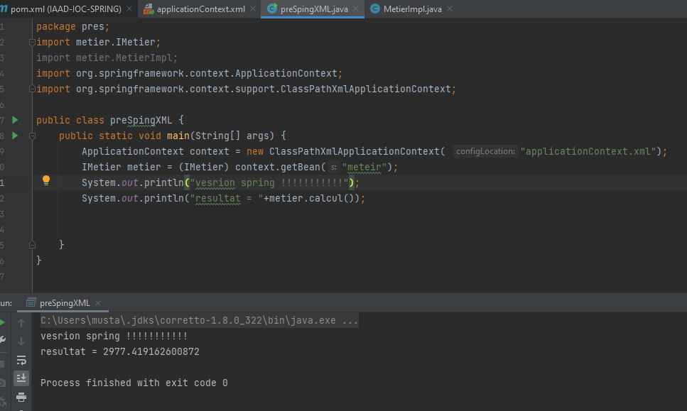
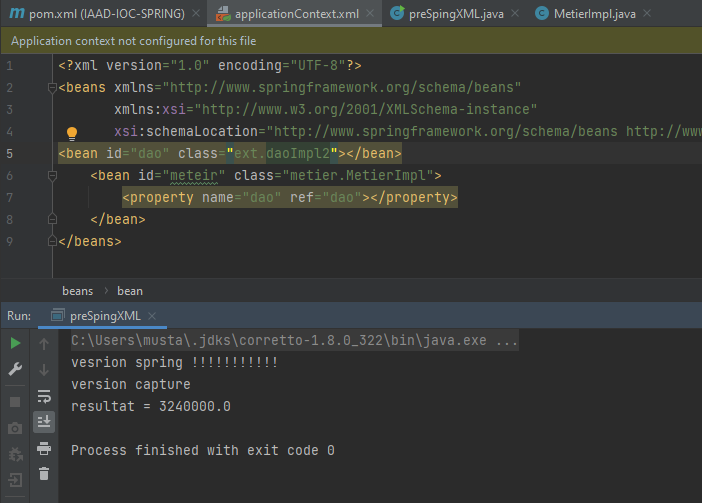
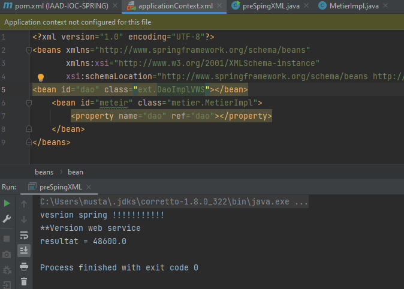
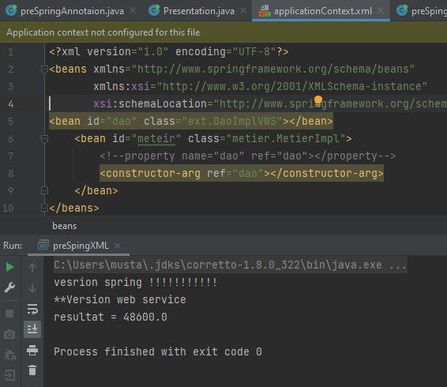
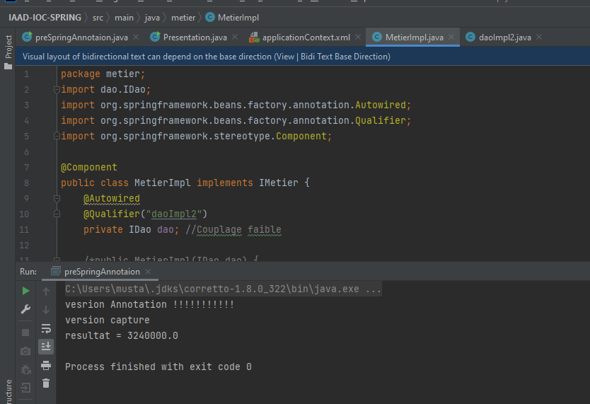
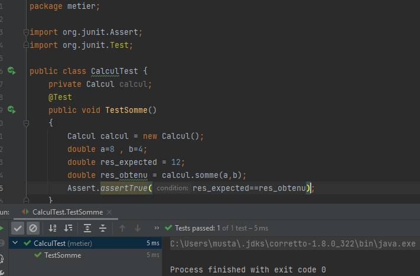

<h1>Deuxième TP d'inversion de contrôle</h1>

<h3>Partie 01 : fichier XML</h3>

<ul>
	<li>Captures </li>
	
	<li>Web Service </li>
	
	<li>L'injection via le constrectur </li>
	
</ul>
<h3>Partie 02 : l'injection de depandence "Version Annotaion</h3>

<h3>Partie 03 : Le test Unitaire"</h3>

